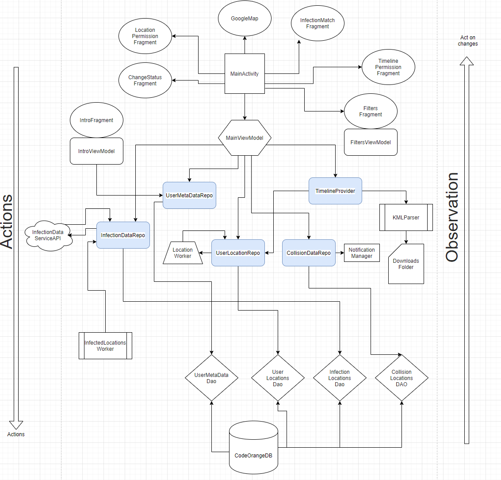

# Code Orange (Covid 19)
**The main goal**:  Help people to get know if they were in touch with an infected person using public APIs and users location (including history)

**THIS IS AN OPEN-SOURCE PROJECT. **
**Please take it, change it, use it as you like.**
We build this project to help people get to know if there were in touch with infected people.

We encourage anyone in the world not to wait for the government to build the app for them but use what we build and adapt to their country and API of infected persons.

###### Side note: It's not bug free. We rush into implementation, and we might miss something. Feel free to submit PR with a FIX.

### Main Functionality:
The application collects location in background and matches it with data from the Israeli Ministry of health. (you can easily switch it to different API)
Also, it uses a chrome app to download file location history from Google TimeLine, later it parses those downloaded files from the "Download folder" and add it to the map and match algorithm
Data stored locally in SQLite, and nothing sent to any server. (We wanted to build API with Ministry of Health but stop due to lack of collaboration)

### High Level Architecture:

##### Some explanation:
MainActivity communicate with actions to MainViewModel
MainViewModel delegates work to corresponding Repo
Repo perform business logic and update DB (Room)
MainViewModel observes on DB changes via "Collect" Flow
MainViewModel publish updates LiveData
MainActivity/Fragment observes LiveData and showing UI accordingly to changes.

#### Stack:
**Kotlin**
**Kotlin Coroutines** - for multithreading
**Kotlin Flow** - for reactive observations
**Koin** as DI
**Google Play Services** for location updates
**Google Map** - well, basically map
**Retrofit 2** - API Requests
**WorkManager** - background work for periodic location and infected data
**Room** - wrapper over SQLite
**Timber** - logs

Remarks:
- Don't forget to update Google Maps API key to yours
- We still didn't finish, "I diagnosed having virus" flow. 

**Contributors**

The app is built with help of developers from [Android Academy in Tel Aviv](https://www.facebook.com/groups/android.academy.ils/) and [Nexar](https://www.getnexar.com) especially Big thanks to Artyom Okun, Yonatan Levin, Eden Bugdary & Daniel Szasz for their help at nights and weekend with this project

Also many thanks to those who contributed to the translation of the app
|Language| Translator |  Organization |
|--|--|--|
| English | Developers | Android Academy |
| Hebrew | Developers | Android Academy |
| Arabic | [Nasim Khoury](mailto:nasim@glocaltrans.com) | [GLOCAL - Translation & Content Solutions](www.glocaltrans.com) |
| Arabic | [Yosif Masarweh](mailto:yosiftbt@gmail.com) |  |
